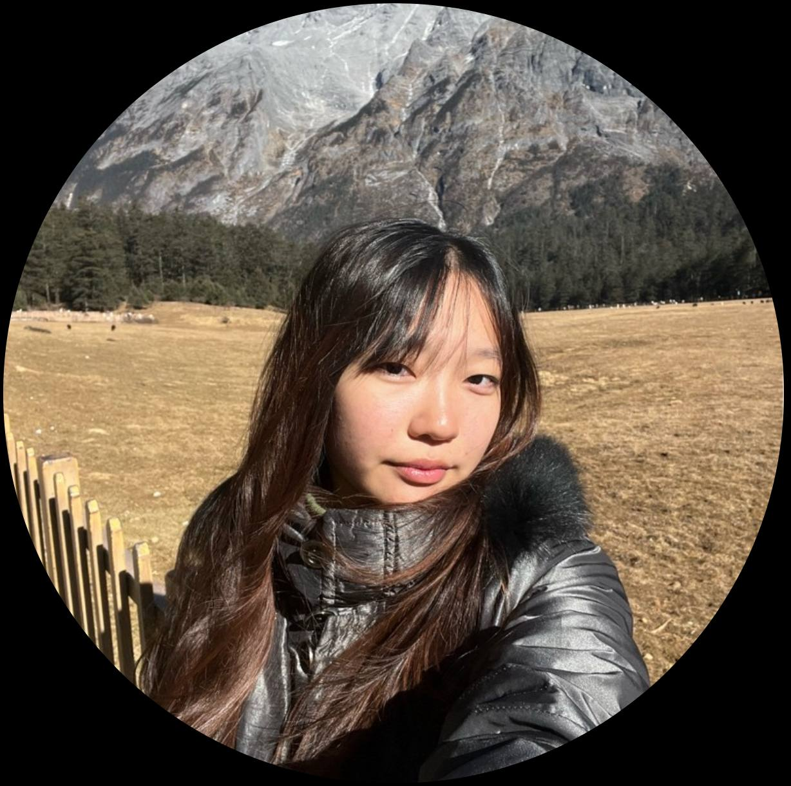
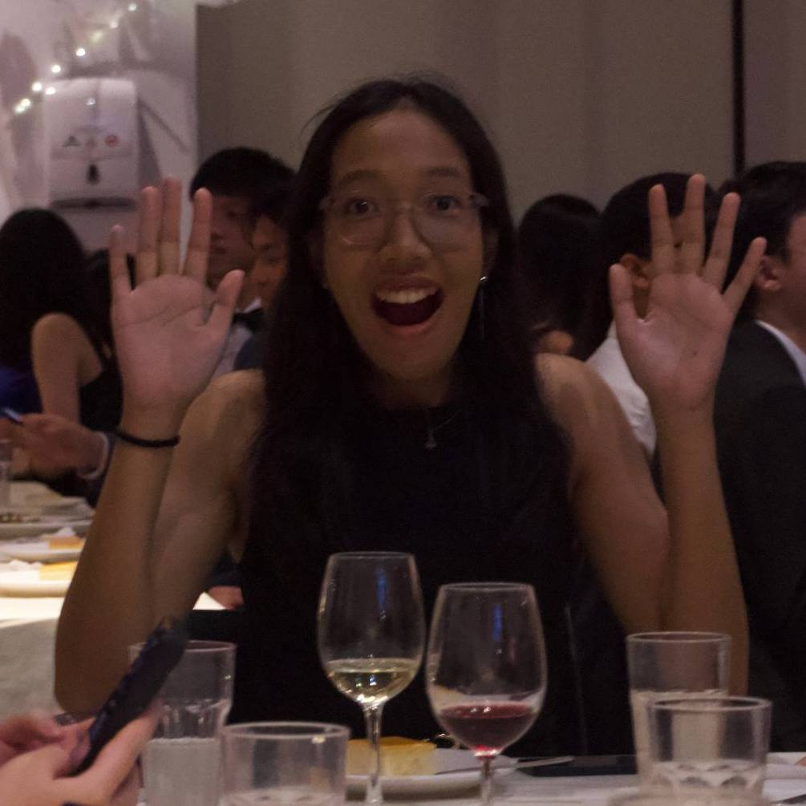
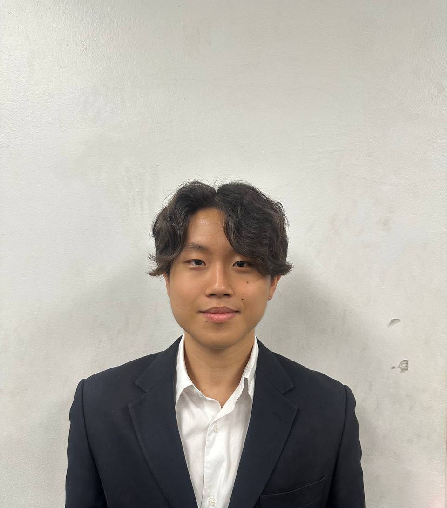
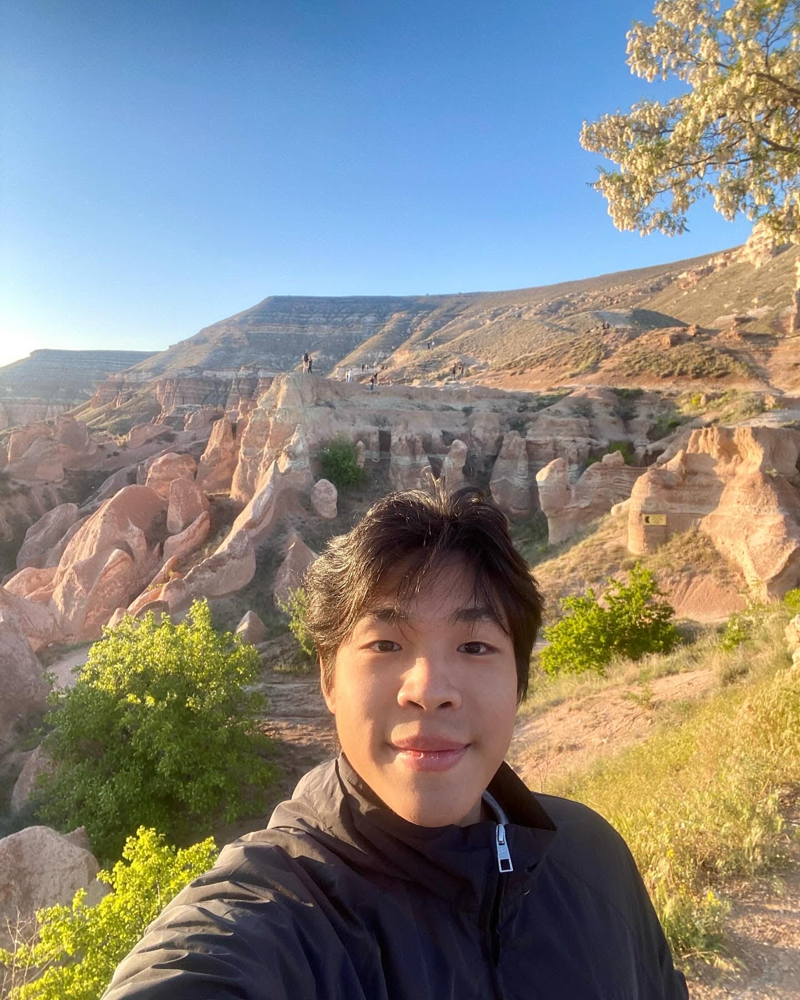

We are a team based in the [School of Computing, National University of Singapore](https://www.comp.nus.edu.sg).

You can reach us at the email `seer[at]comp.nus.edu.sg`

## Project team

### Yu Tingan

[[homepage](https://llamawithhats.github.io/ip/)]
[[github](https://github.com/llamawithhats)]
[[portfolio](team/llamawithhats.md)]

* Role: Developer

### Beh Shao Ren

[[github](http://github.com/ren0716)]
[[portfolio](team/ren0716.md)]

* Role: Developer
* Responsibilities: UI

### Hnin Sat Phyu Sin

[[github](http://github.com/hninsatphyusin)] [[portfolio](team/hninsatphyusin.md)]

* Role: Developer
* Responsibilities: Data

### Timothy Tia Yi Zhi

[[github](http://github.com/timxthytia)]
[[portfolio](team/timxthytia.md)]

* Role: Developer
* Responsibilities: Dev Ops + Threading

### Darren Sng

[[github](http://github.com/sngdarren)]
[[portfolio](team/sngdarren.md)]

* Role: Developer
* Responsibilities: Object Oriented Programming
