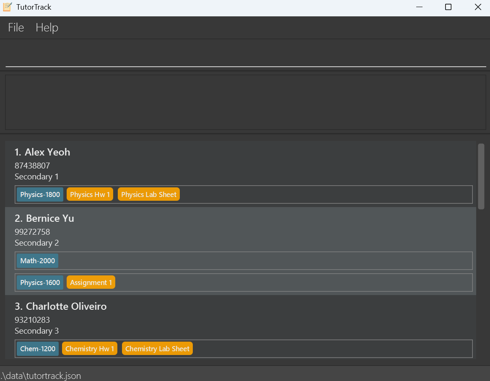
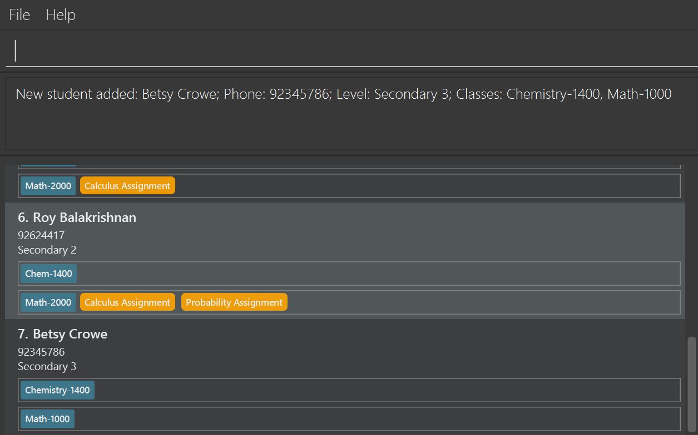
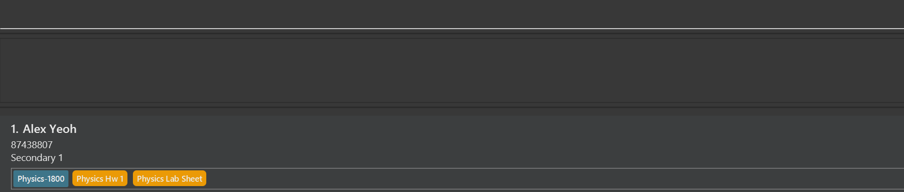
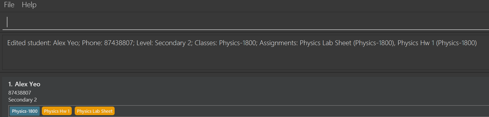
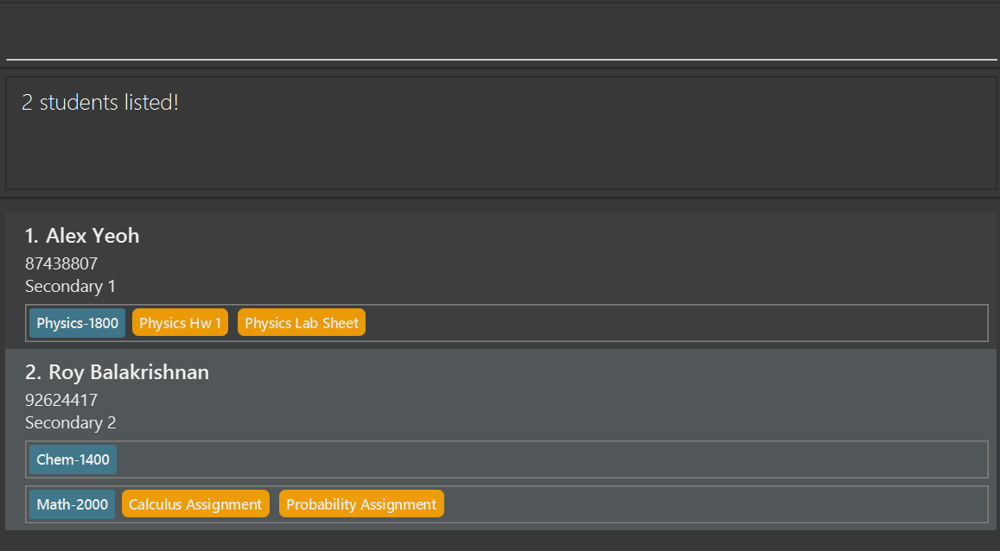
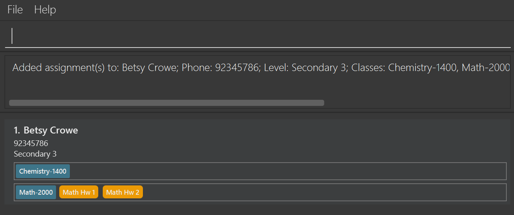
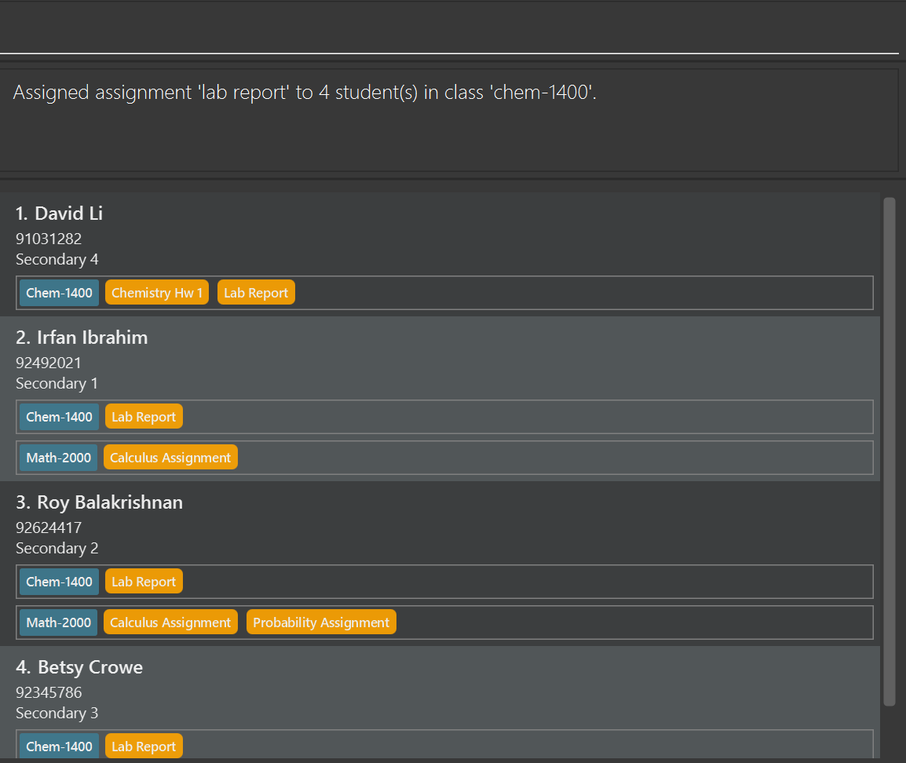
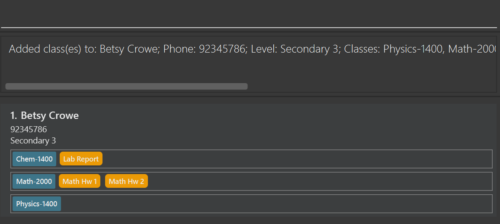

<frontmatter>
  title: "User Guide"
</frontmatter>

# User Guide

TutorTrack is a **desktop app** designed to help **Secondary School tutors** keep track of their **students, classes and assignments.** Unlike conventional contact management systems, TutorTrack is optimized for **rapid keyboard operation**, catering to tutors who favor typing-based workflows over mouse-driven ones.

<!-- * Table of Contents -->
<page-nav-print />

--------------------------------------------------------------------------------------------------------------------

## Quick start

1. Ensure you have Java `17` or above installed in your Computer. 
   2. To verify your Java version, open a terminal and execute the command `java -version`. If Java is not installed or the version is below 17, please download and install the latest JDK from [here](https://www.oracle.com/java/technologies/javase/jdk17-archive-downloads.html) or use a package manager like Homebrew.

    

    **:exclamation: Duplicate Checks:** 
       **For Mac users:** Ensure you have the precise JDK version prescribed [here](https://se-education.org/guides/tutorials/javaInstallationMac.html).
    

2. Download the latest `.jar` file from [here](https://github.com/AY2526S1-CS2103T-F14b-3/tp/releases). Find it by scrolling down to the **Assets** section of the latest release. 

3. Copy the file to the folder you want to use as the _home folder_ for TutorTrack.

4. Run the application by following these steps: 
   1. Open a command window:
      - **Windows**: Press **Windows** + **R**, type `cmd`, and press **Enter**.
      - **Mac/Linux**: Open the Terminal app.
   2. Go to the folder where you saved the tutortrack.jar file:
      - Type `cd`(with a space after it), then drag and drop the folder into the window.
      - Press **Enter**. 
   3. Run the app:
      - Type this command and press **Enter**:  
        `java -jar tutortrack.jar`
   4. A GUI similar to the below should appear in a few seconds. Note how the app contains some sample data. 
   

5. Type the command in the command box and press **Enter** to execute it. e.g. typing **`help`** and pressing **Enter** will open the help window. 
   Some example commands you can try:

   * `list` : Lists all students.

   * `add n/John Doe p/98765432 l/2 c/Physics-1800` : Adds a student contact named `John Doe` to TutorTrack.

   * `delete 3` : Deletes the 3rd contact shown in the current list.

   * `clear` : Deletes all students.

   * `exit` : Exits the app.

1. Refer to the [Features](#features) below for details of each command.

--------------------------------------------------------------------------------------------------------------------

## Features

<box type="info" seamless>

**Notes about the command format:** 

* Words in `UPPER_CASE` are the parameters to be supplied by the user. 
  e.g. in `add n/NAME`, `NAME` is a parameter which can be used as `add n/John Doe`.

* Items in square brackets are optional. 
  e.g `n/NAME [c/CLASS] [a/ASSIGNMENT]` can be used as `n/John Doe c/Physics-1800 a/Assignment 1` or as `n/John Doe`.

* Items with `…`​ after them can be used multiple times including zero times. 
  e.g. `[c/CLASS]…​` can be used as ` ` (i.e. 0 times), `c/Physics-1800`, `c/Math-1400 c/Physics-1800` etc.

* Parameters (excluding INDEX) can be in any order. 
  e.g. if the command specifies `n/NAME p/PHONE`, `p/PHONE n/NAME` is also acceptable.

* Prefixes and parameters are case-insensitive. 
  e.g. `n/NAME` and `N/NAME` are treated the same, likewise with `n/John Doe` and `n/john doe`.

* Extraneous parameters for commands that do not take in parameters (such as `help`, `list`, `exit`, `clear`, `undo` and `redo`) will be ignored. 
  e.g. if the command specifies `help 123`, it will be interpreted as `help`.

* If you are using a PDF version of this document, be careful when copying and pasting commands that span multiple lines as space characters surrounding line-breaks may be omitted when copied over to the application.
</box>

<box type="info" seamless>

**Notes about parameter validation rules:** 

* `NAME` parameter values allows only alphanumeric values, spaces, hyphens, periods, apostrophes and slashes.   **(Letters that come after apostrophes, dashes, slashes, periods are automatically capitalised)**  
  e.g. `n/John Doe`, `n/Betsy O'Connor`, `n/Mary-Jane Smith Jr.` are all acceptable but `n/John@Doe`, `n/John#1` is not.

* `CLASS` and `ASSIGNMENT` parameter values allows only alphanumeric values, spaces and hyphens. 
  e.g. `c/Math-1000`, `c/Computer Science 101`, `a/Project Draft 1` are all acceptable but `c/Math@1000`, `c/Math(1000)` is not.

* **[WARNING]** Whitespace inside `NAME`, `CLASS` and `ASSIGNMENT` parameter values is preserved and treated as significant. 
  e.g. `c/Math2000` will be different from `c/Math 2000`.

* `PHONE` parameter values must be numeric and be at least 3 digits long. 
  e.g. `p/98765432` is acceptable but `p/98A7654` or `p/12` is not.

* `LEVEL` parameter values must be an integer between 1 and 5 (inclusive). 
    e.g. `l/2` is acceptable but `l/0`, `l/6`, `l/2.5`, `l/two` are not.
</box>

<box type="warning" seamless>

**Duplicate Checks:** 

* Students:
  * Students are considered duplicates if they have the same name (case-insensitive) AND phone number.
  * Students with same name but different phone numbers can be added with a _warning_.
  * Students with same phone number but different names can be added with a _warning_.
* Assignments:
  * Assignments are considered duplicates if the student already has an assignment with the assignment name (case-insensitive) from the same class.
* Classes:
  * Classes are considered duplicates if the student is already enrolled in a class with the same class name (case-insensitive).
</box>

### Viewing help : `help`

Shows a message explaining how to access the help page.

Format: `help`

### Adding a student: `add`

Adds a student to TutorTrack.

Format: `add n/NAME p/PHONE l/LEVEL [c/CLASS]…​`

 <strong>Tip:</strong>
A student can have any number of classes and assignments (including 0)

Examples:
* `add n/John Doe p/98765432 l/2`
* `add n/Betsy Crowe p/92345786 c/Chemistry-1400 l/3 c/Math-1000` 
    

### Deleting a student : `delete`

Deletes the specified student from TutorTrack.

Format: `delete INDEX`

* Deletes the student at the specified `INDEX`.
* The index refers to the index number shown in the displayed student list.
* The index **must be a positive integer** 1, 2, 3, …​

Examples:
* `list` followed by `delete 2` deletes the 2nd student in the student list.
* `find Betsy` followed by `delete 1` deletes the 1st student in the results of the `find` command.

### Listing all students : `list`

Shows a list of all students in TutorTrack.

Format: `list`

### Editing a student : `edit`

Edits an existing student in TutorTrack.

Format: `edit INDEX [n/NAME] [p/PHONE] [l/LEVEL]`

* Edits the student at the specified `INDEX`. 
* The index refers to the index number shown in the displayed student list. 
* The index **must be a positive integer** 1, 2, 3, …​
* At least one of the optional fields must be provided.
* Existing values will be updated to the input values.
* Classes and assignments cannot be edited via the `edit` command.

Examples:
*  `edit 2 p/91234567` Edits the phone number of the 2nd student to be `91234567`.
*  `edit 1 n/Alex Yeo l/2` Edits the name of the 1st student to be `Alex Yeo` and the level to `2`.  
 

### Locating students by name: `find`

Finds students whose names contain any of the given keywords.

Format: `find KEYWORD [MORE_KEYWORDS]`

* The search is case-insensitive. e.g `hans` will match `Hans`
* The order of the keywords does not matter. e.g. `Hans Bo` will match `Bo Hans`
* Only the name is searched.
* Only full words will be matched e.g. `Han` will not match `Hans`
* Students matching at least one keyword will be returned (i.e. `OR` search).
  e.g. `Hans Bo` will return `Hans Gruber`, `Bo Yang`

Examples:
* `find John` returns `john` and `John Doe`
* `find alex roy` returns `alex`, `roy` 
  

### Filtering students by class: `filter`

Finds and lists all students who are in the specified class name.

Format: `filter c/CLASS`

* Filters students by the specified class name.
* The search is case-insensitive. e.g., `math-1000` will match `Math-1000`
* Only one class can be specified at a time.
* Only students with an exact match to the class name will be shown.

Examples:
* `filter c/Math-1000` displays all students enrolled in the Math-1000 class.
* `filter c/Chemistry-1400` followed by `filter c/Math-1000` displays all students enrolled in both Chemistry-1400 and Math-1000 class.

 <strong>Tip:</strong>

After a `filter` command, filtered list will remain for further operations (i.e. stacking commands on top of `filter` command is allowed). To get back to the full student list, use the [`list`](#listing-all-students--list) command.

### Adding assignment(s) to a student: `assign`

Adds one or more assignments to the specified student in TutorTrack.

Format: `assign INDEX c/CLASS a/ASSIGNMENT [a/ASSIGNMENT]...`

* Adds assignment(s) belonging to specified class to the student at the specified `INDEX`.
* The index refers to the index number shown in the displayed student list.
* The index **must be a positive integer** 1, 2, 3, …​
* At least one assignment must be provided.
* Duplicate assignments will not be added.

Examples:
* `find John` followed by `assign 2 c/History a/ProjectDraft` adds an assignment from class `History` to the 2nd student in the results of the `find` command.
* `list` followed by `assign 1 c/Math-2000 a/Math Hw 1 a/Math Hw 2` adds two assignments from class `Math-2000` to the 1st student in the student list. 

### Deleting assignment(s) from a student: `unassign`

Deletes one or more assignments from the specified student in TutorTrack.

Format: `unassign INDEX c/CLASS a/ASSIGNMENT [a/ASSIGNMENT]...`

* Deletes assignment(s) belonging to specified class from the student at the specified `INDEX`.
* The index refers to the index number shown in the displayed student list.
* The index **must be a positive integer** 1, 2, 3, …​
* At least one assignment must be provided.

Examples:
* `list` followed by `unassign 1 c/Math-2000 a/MathHW1 a/MathHW2` deletes two assignments from class `Math-2000` from the 1st student in the student list.
* `find John` followed by `unassign 2 c/History a/ProjectDraft` deletes an assignment from class `History` from the 2nd student in the results of the `find` command.

### Adding an assignment to all students in a class: `assignall`

Assigns an assignment to all students in the specified class.

Format: `assignall c/CLASS a/ASSIGNMENT`

* Assigns the specified assignment to all students in the specified class.
* No changes are made to students who already have the specified assignment in the specified class.
* If all students in the specified class already have the specified assignment, no changes will be made.

Examples:
* `assignall c/Math-2000 a/MathHW1` assigns the assignment `MathHW1` to all students in the class `Math-2000`.
* `assignall c/Chem-1400 a/Lab Report` assigns the assignment `Lab Report` to all students in the class `Chem-1400`.

### Deleting an assignment from all students in a class: `unassignall`

Deletes an assignment from all students in the specified class.

Format: `unassignall c/CLASS a/ASSIGNMENT`

* Deletes the specified assignment from all students in the specified class.
* No changes are made to students who do not have the specified assignment in the specified class.
* If no students in the specified class have the specified assignment, no changes will be made.

Examples:
* `unassignall c/Math-2000 a/MathHW1` unassigns the assignment `MathHW1` from all students in the class `Math-2000`.
* `unassignall c/Chemistry-1400 a/ProjectDraft` unassigns the assignment `ProjectDraft` from all students in the class `Chemistry-1400`.

### Marking an assignment as completed: `mark`

Marks the assignment of student(s) identified by the index number(s) used in the displayed student list and the assignment name.

Format: `mark [INDEX]... [INDEX_RANGE]...  c/CLASS a/ASSIGNMENT`

* Marks the assignment belonging to the specified class as completed for the student(s) at the specified `INDEX`(es) and/or `INDEX_RANGE`(s).
* At least one index or index range must be provided.
* The index(es) refers to the index number shown in the displayed student list.
* The index(es) **must be a positive integer** 1, 2, 3, …​

 <strong>Tip:</strong>

For efficient marking of assignments for a specific class, use the [`filter`](#filtering-students-by-class-filter) command first to display only students in that class, then use `mark` with the filtered list.

Examples:
* `list` followed by `mark 1 3-5 c/Math-2000 a/Math Hw 1` marks the assignment `MathHW1` from class `Math-2000` as completed for the 1st, 3rd, 4th and 5th students in the student list.
* `find John` followed by `mark 2 c/History a/ProjectDraft` marks the assignment `ProjectDraft` from class `History` as completed for the 2nd student in the results of the `find` command.
* `filter c/Math-2000` followed by `mark 1-3 c/Math-2000 a/Math Hw 1` marks the assignment for the first 3 students in the Math-2000 class (recommended workflow).

### Unmarking an assignment as not completed: `unmark`

Unmarks the assignment of student(s) identified by the index number(s) used in the displayed student list and the assignment name.

Format: `unmark [INDEX]... [INDEX_RANGE]...  c/CLASS a/ASSIGNMENT`

* Unmarks the assignment belonging to the specified class as not completed for the student(s) at the specified `INDEX`(es) and/or `INDEX_RANGE`(s).
* At least one index or index range must be provided.
* The index(es) refers to the index number shown in the displayed student list.
* The index(es) **must be a positive integer** 1, 2, 3, …​

 <strong>Tip:</strong>

Like [`mark`]( #marking-an-assignment-as-completed-mark ), use [`filter`](#filtering-students-by-class-filter) first for efficient unmarking by class.

Examples:
* `list` followed by `unmark 1 3-5 c/Math-2000 a/MathHW1` unmarks the assignment `MathHW1` from class `Math-2000` as not completed for the 1st, 3rd, 4th and 5th students in the student list.
* `find John` followed by `unmark 2 c/History a/ProjectDraft` unmarks the assignment `ProjectDraft` from class `History` as not completed for the 2nd student in the results of the `find` command.
* `filter c/Chemistry-1400` followed by `unmark 5-8 c/Chemistry-1400 a/Lab Report` unmarks the assignment for students 5-8 in the Chemistry-1400 class (recommended workflow).

### Adding class(es) to a student: `addclass`

Adds one or more classes to the specified student in TutorTrack.

Format: `addclass INDEX c/CLASS [c/CLASS]...`

* Adds class(es) to the student at the specified `INDEX`.
* The index refers to the index number shown in the displayed student list.
* The index **must be a positive integer** 1, 2, 3, …​
* At least one class must be provided.
* Class names must be alphanumeric and may contain spaces or hyphens.
* Class names must start with an alphanumeric character (letter or digit).
* Duplicate classes will not be added.

Examples:
* `list` followed by `addclass 1 c/Math-1000 c/Physics-2000` adds two classes to the 1st student in the student list.
* `find Betsy` followed by `addclass 1 c/Physics-1400` adds a class to the 1st student in the results of the `find` command.

### Deleting class(es) from a student: `deleteclass`

Deletes one or more classes from the specified student in TutorTrack.

Format: `deleteclass INDEX c/CLASS [c/CLASS]...`

* Deletes class(es) from the student at the specified `INDEX`.
* The index refers to the index number shown in the displayed student list.
* The index **must be a positive integer** 1, 2, 3, …​
* At least one class must be provided.
* Class names must be alphanumeric and may contain spaces or hyphens.
* Class names must start with an alphanumeric character (letter or digit).
* Only classes that exist for the student can be deleted.

Examples:
* `list` followed by `deleteclass 1 c/Math-1000 c/Physics-2000` deletes two classes from the 1st student in the student list.
* `find John` followed by `deleteclass 2 c/Chemistry-1400` deletes a class from the 2nd student in the results of the `find` command.

 <strong>Caution:</strong>

Deleting a class deletes all assignments associated with it for that student as well.

### Clearing all entries : `clear`

Clears all entries from TutorTrack.

Format: `clear`

### Undoing previous command : `undo`

Undoes the previous command that modified the data.

Format: `undo`

* Restores TutorTrack to the state before the last command that changed the data.
* Only commands that modify data (e.g., `add`, `delete`, `edit`, `assign`, `mark`) can be undone.
* Commands that do not modify data (e.g., `list`, `find`, `help`) cannot be undone.

 <strong>Tip:</strong>

If you accidentally deleted a student or made an unwanted change, use `undo` to quickly restore the previous state.

 <strong>Caution:</strong>

Undo/Redo only works for actions made in the **current session**. Once you leave or refresh, previous changes cannot be restored.

Examples:
* `delete 1` followed by `undo` adds the deleted student back.

### Redoing previously undone command : `redo`

Redoes a command that was previously undone.

Format: `redo`

* Redo only works if no new commands have been issued after the undo.
* After using `undo` multiple times, you can use `redo` multiple times to reapply those changes.

Examples:
* `delete 1` followed by `undo` followed by `redo` deletes the student again.

### Exiting the program : `exit`

Exits the program.

Format: `exit`

### Saving the data

TutorTrack data are saved in the hard disk automatically after any command that changes the data. There is no need to save manually.

### Editing the data file

TutorTrack data are saved automatically as a JSON file `[JAR file location]/data/tutortrack.json`. Advanced users are welcome to update data directly by editing that data file.

 <strong>Caution:</strong>
If your changes to the data file makes its format invalid, TutorTrack will discard all data and start with an empty data file at the next run. Hence, it is recommended to take a backup of the file before editing it. 
Furthermore, certain edits can cause TutorTrack to behave in unexpected ways (e.g., if a value entered is outside of the acceptable range). Therefore, edit the data file only if you are confident that you can update it correctly.

--------------------------------------------------------------------------------------------------------------------

## Keyboard Shortcuts

#### Navigating command history

Navigate through 50 previously inputted commands using keyboard shortcuts.

* **Up Arrow Key (↑)**: Retrieves the previous command from history
* **Down Arrow Key (↓)**: Retrieves the next command from history

#### Other shortcuts

* **F1**: Opens the help window

--------------------------------------------------------------------------------------------------------------------

## FAQ

**Q**: How do I transfer my data to another Computer? 
**A**: Install the app in the other computer and overwrite the empty data file it creates with the file that contains the data of your previous TutorTrack home folder.

**Q**: Can I use TutorTrack on multiple computers? 
**A**: Yes, but TutorTrack does not support real-time synchronization. You will need to manually transfer the `tutortrack.json` data file between computers to keep data consistent.

**Q**: What if the data file becomes corrupted? 
**A**: Restore from your backup. If no backup exists, the app will create a fresh `tutortrack.json` and you may lose previous data.

**Q**: How do I back up my data? 
**A**: Regularly copy `data/tutortrack.json` (and optionally `preferences.json`) to a secure location, such as an external hard drive or cloud storage service.

**Q**: Can I edit `data/tutortrack.json` manually? 
**A**: Yes, but only if you know the expected JSON structure. Always make a backup first; invalid edits may cause the app to discard data on next run.

**Q**: Will data work across app versions? 
**A**: Minor patch updates are generally compatible. For major version changes, check release notes for migration instructions before copying files.

--------------------------------------------------------------------------------------------------------------------

## Known issues

1. **When using multiple screens**, if you move the application to a secondary screen, and later switch to using only the primary screen, the GUI will open off-screen. The remedy is to delete the `preferences.json` file created by the application before running the application again. 

<box type="info" seamless>

**How to find `preferences.json`:** 
   
**Windows**: 
1. Go to the same folder where you keep your `tutortrack.jar` file.  
2. Look for a file named `preferences.json` in that folder (it might be inside a subfolder named something like `data` or `.tutortrack`).  
3. Delete `preferences.json`.  
4. Run the app again using: `java -jar tutortrack.jar` 
5. The GUI should now open on your primary screen. 

**Mac/Linux**: 
1. Open **Finder** (Mac) or **Files** app (Linux). 
2. Go to the folder where your `tutortrack.jar` file is saved.  
3. Find and delete the `preferences.json` file (it might be in a hidden folder called `.tutortrack` — press **Command** + **Shift** + **.** on Mac to show hidden files).  
4. Start the app again — it will open correctly. 
</box>

2. **If you minimize the Help Window** and then run the `help` command (or use the `Help` menu, or the keyboard shortcut `F1`) again, the original Help Window will remain minimized, and no new Help Window will appear. The remedy is to manually restore the minimized Help Window.

--------------------------------------------------------------------------------------------------------------------

## Command summary

Action | Format, Examples
--------|------------------
**[Help](#viewing-help-help)** | `help`
**[Add](#adding-a-student-add)** | `add n/NAME p/PHONE l/LEVEL [c/CLASS]…​`   e.g., `add n/John Doe p/98765432 l/2 c/Chemistry-1400`
**[Delete](#deleting-a-student-delete)** | `delete INDEX`  e.g., `delete 3`
**[List](#listing-all-students-list)** | `list`
**[Edit](#editing-a-student-edit)** | `edit INDEX [n/NAME] [p/PHONE] [l/LEVEL]`  e.g., `edit 1 p/91234567`
**[Find](#locating-students-by-name-find)** | `find KEYWORD [MORE_KEYWORDS]`  e.g., `find John`
**[Filter](#filtering-students-by-class-filter)** | `filter c/CLASS`  e.g., `filter c/Math-1000`
**[Assign](#adding-assignments-to-a-student)** | `assign INDEX c/CLASS a/ASSIGNMENT [a/ASSIGNMENT]...`  e.g., `assign 1 c/Math-2000 a/MathHW1 a/MathTopic2`
**[Unassign](#deleting-assignments-from-a-student-unassign)** | `unassign INDEX c/CLASS a/ASSIGNMENT [a/ASSIGNMENT]...`  e.g., `unassign 1 c/Math-2000 a/MathHW1`
**[Assign All](#adding-an-assignment-to-all-students-in-a-class-assignall)** | `assignall c/CLASS a/ASSIGNMENT`  e.g., `assignall c/Math-2000 a/MathHW1`
**[Unassign All](#deleting-an-assignment-from-all-students-in-a-class-unassignall)** | `unassignall c/CLASS a/ASSIGNMENT`  e.g., `unassignall c/Math-2000 a/MathHW1`
**[Mark](#marking-an-assignment-as-completed-mark)** | `mark [INDEX]... [INDEX_RANGE]...  c/CLASS a/ASSIGNMENT`  e.g., `mark 1 3-5 c/Math-2000 a/MathHW1`
**[Unmark](#unmarking-an-assignment-as-not-completed-unmark)** | `unmark [INDEX]... [INDEX_RANGE]...  c/CLASS a/ASSIGNMENT`  e.g., `unmark 1 3-5 c/Math-2000 a/MathHW1`
**[Add Class](#adding-classes-to-a-student-addclass)** | `addclass INDEX c/CLASS [c/CLASS]...`  e.g., `addclass 1 c/Math-1000 c/Physics-2000`
**[Delete Class](#deleting-classes-from-a-student-deleteclass)** | `deleteclass INDEX c/CLASS [c/CLASS]...`  e.g., `deleteclass 1 c/Math-1000`
**[Clear](#clearing-all-entries-clear)** | `clear`
**[Undo](#undoing-previous-command-undo)** | `undo`
**[Redo](#redoing-previously-undone-command-redo)** | `redo`
**[Exit](#exiting-the-program-exit)** | `exit`
